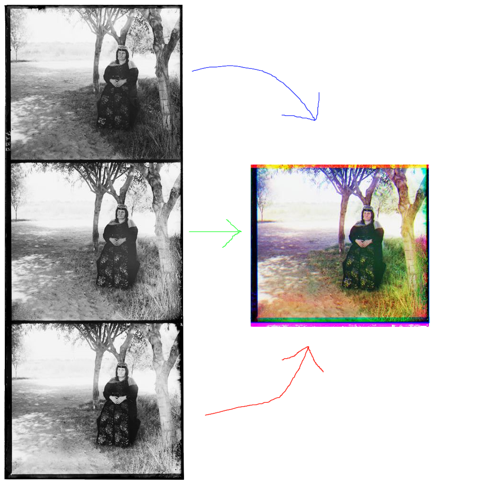

**[Computer Vision Thermal Comfort Prediction Engine](http://josephschiarizzi.com/Thermal-comfort-computer-vision/)**
----------

This [open source](https://github.com/jschiarizzi/Thermal-comfort-computer-vision) project is a series of python scripts utilizing OpenCV (open source computer vision) to get useful data from Infra-Red and true color images of people's (Karl's) faces in order to guess if they are comfortable in the given temperature.

A long-term solution to this problem is to develop a smart home thermostat that uses computer vison to automatically detect a person’s thermal comfort level and adjust the room temperature accordingly. Computer vision coupled with machine learning are vastly growing fields of research that have the potential to predict a person’s thermal comfort level. This smart thermostat will save home owners and buildings managers lots money. Why waste energy heating your whole house if you are only in one room at a time? The best part is that it is hands free!

---

**[Meteorite Heat Map](http://josephschiarizzi.com/meteor-heatmap/)**
----------

This [open source](https://github.com/jschiarizzi/meteor-heatmap) map displays a heat map of the locations of where all known meteorites have landed on earth.  It was created with a public [data](https://data.nasa.gov/Space-Science/Meteorite-Landings/gh4g-9sfh) set from NASA and an API from [Mapbox](http://mapbox.com).  The map includes some nice color effects for the density of landings as well as more information on meteorites (date of landing & weight) when zoomed in on and clicked.

---

**[Aligning and compositing the images of the Prokudin-Gorskii photo collection](http://josephschiarizzi.com/rgb-aligner/)**
----------

The goal of this project was to experiment with some Computer Vision libraries.  I take red + green + blue filtered images from Russia in about 1905 and attempt to automate their alignment, created a full colored image. The base images are from the Library of Congress's [Prokudin-Gorskii photo collection](http://www.loc.gov/pictures/collection/prok/).  This project uses python, openCV, and some common computer vision libraries.

---

**[Virginia House Fall 2017 Election - Democrats Map](http://josephschiarizzi.com/Virginia-dems-election-map-2017/)**
----------

This map plots all the Virginia House of Delegates districts, and colors them based on the Fall 2017 election.  It also includes information and links for all democrats running for in the state.  This list was generated using automations in javascript. The map functionality and styling was created using APIs from [Mapbox](http://mapbox.com). I made this map for a contract with [WinVirginia](http://winvirginia.org/) in the summer of 2017 and the code for it has been [open sourced](https://github.com/jschiarizzi/Virginia-dems-election-map-2017).  If you have an idea for a custom map you would like produced, please contact me.

---

**[Next Big Thing Bot](https://twitter.com/nextbigthingbot)**
----------

This is a quick project leveraging a few neat tools.  Next Big Thing Bot generates startup ideas based on "the next X but for Y" format.  The list of X and Y terms was crowd sourced by about a dozen people on github.  Feel free to send a [pull request](https://github.com/jschiarizzi/XforYgen) if you would like to add some terms.  The bot is automated using [Glitch](http://glitch.com), which is a service for setting up instant servers.  The server is pinged every 12 hours from an HTTP request sent by [If This Then That](ifttt.com) (IFTTT). The IFTTT service is very fun to play with and so is glitch.

Check out the glitch [site](https://xforygen.glitch.me/) hosting the bot.

---

**[My Town Hall](https://devpost.com/software/townhall)**
----------

Winner at HopHacks Fall 2016 (at Johns Hopkins University)

Most people don't follow their local legislature, and may not realise how much local laws affect them directly.  In the state of Maryland, on October First 2016, 35 new laws went into effect but chances are most residents aren’t aware of this.  *My Town Hall* is an android app which allows users to passively track when local laws come into effect in their area.  Users simply insert their Zip Code and the app allows them to view categories of laws that affect them personally.

Along with this project I also created a public facing API hosted on Amazon’s AWS with a Flask server.  The API allowed access to json files with information on law summaries, the date they go into effect, and where they affect.  This API was created for demonstration purposes and is no longer being hosted.  If this is a particular interest of yours please contact me for more info.

---

**[TuneCrypter](http://devpost.com/software/tunecrypter-bitcamp16)**
----------

Winner of Cipher Tech's Best Digital Forensics Related Hack at Bitcamp 2016.

Why should we use simple plain text to encrypt messages when we can combine amplitudes, frequencies, and wavelength of sound waves.  This open source project, created at Bit Camp 2016, lets you add secret encrypted messages to .WAV files and share.  Add a secure secret message to the background of your favorite song, send it to your friend, and they can decrypt it with your shared key!

---

**[BusiScan](https://github.com/BusyScanner/BusiScan-Android)**
----------

BusiScan is an android application that allows users to take pictures of business cards to instantly add all information on it to their contacts in their phone.  The android side was developed by my friend [Amitav Khandel](http://www.amitavkhandelwal.com/), an amazing developer.  The project utilizes [HP's Idol onDemand API](https://dev.havenondemand.com/apis) to convert from pictures to text and included a backend to allow business owners to check where their cards are being scanned.

---

**Twitter4M**
----------

This project utilizes the [Twitter4J](http://twitter4j.org/en/index.html) library, which brings the twitter API to java.  Twitter4M, built during [HoyaHacks 2016](http://www.hoyahacks.com/), brings twitter to minecraft in a simple [bukkit](https://www.spigotmc.org/) plugin. Simply drag the .jar file into the plugin folder, restart the server, and you can now tweet to a single twitter account from inside your minecraft server.  A working public version of this has not being released for security issues.  The plugin must have access to the secret keys associated with a user's account, and since I don't want anyone to be able to tweet to my twitter account from their minecraft server I have chosen to keep it private.  

If you have a specific interest in this plugin feel free to contact me.

---

**[Sanabit](https://github.com/mihilmy/sinabit)**
----------

Sanabit is a program that allows doctors and people going through physical therapy (PT) to monitor and track their progress.  This program was inspired by my friend Ali, who has struggled with ankle problems for years, needing PT daily to be able to walk at all.  After doing PT daily for years it is hard to see any progress being made.  This led to depression for my friend and something I hoped to solve with a great group of coders at HopHacks 2015.  By reprogramming the [Myo armband](https://www.myo.com/) to work on ankles we were able to accurately measure a patients progress in many common PT exercises.
